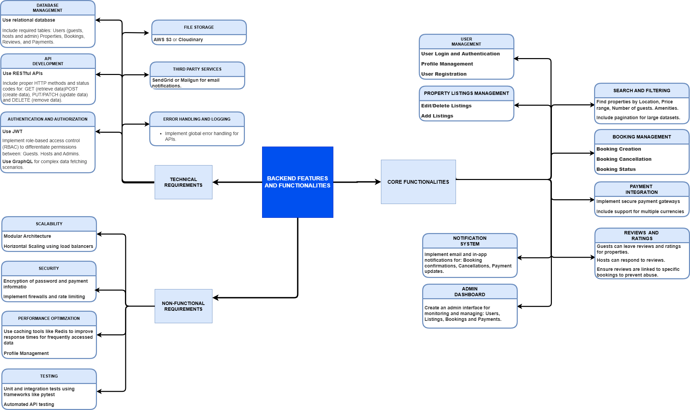

# Airbnb Clone Backend Feature Specification

## Core Functionalities

The backend for the Airbnb Clone must enable key features that align with the functionalities of a rental marketplace.

### 1. User Management

#### User Registration

* Allow users to sign up as guests or hosts.
* Secure password handling using hashing algorithms (e.g., bcrypt).
* Generate and manage JWT tokens for session control.

#### User Login and Authentication

* Login via email and password.
* Optional: OAuth login with providers like Google or Facebook.

#### Profile Management

* Users can update profile information: name, contact details, photo, etc.
* Store profile photos using file storage.

### 2. Property Listings Management

#### Add Listings

* Hosts create property listings with:

  * Title, Description, Address
  * Location (linked to Location and Country tables)
  * Price per night, amenities
  * Availability dates
  * Photos (stored via file storage)

#### Edit/Delete Listings

* Hosts can update listing details.
* Hosts can delete listings (soft delete recommended).

### 3. Search and Filtering

* Search properties by:

  * Location (city, country)
  * Price range
  * Number of guests
  * Amenities (e.g., Wi-Fi, pet-friendly, pool)
* Implement pagination for results.

### 4. Booking Management

#### Booking Creation

* Guests book properties for specific dates.
* Prevent overlapping bookings using date validation logic.

#### Booking Cancellation

* Users (guest or host) can cancel based on rules.

#### Booking Status Tracking

* Booking statuses: pending, confirmed, canceled, completed.

### 5. Payment Integration

* Secure payment flow using gateways like Stripe or PayPal.
* Guests make payments at booking.
* Hosts receive payout after check-out.
* Handle refunds and partial payments.
* Multi-currency support.

### 6. Reviews and Ratings

* Guests leave reviews linked to bookings.
* Hosts can respond to reviews.
* Prevent fake reviews by validating booking history.

### 7. Notifications System

* Email and in-app notifications for:

  * Booking status changes
  * Payment confirmations
  * Profile updates

### 8. Admin Dashboard

* Manage and monitor:

  * Users
  * Listings
  * Bookings
  * Payments
* View analytics and platform metrics.

---

## 🛠️ Technical Requirements

### 1. Database Management

* Use PostgreSQL or MySQL.
* Key Tables:

  * Users
  * Properties
  * Bookings
  * Reviews
  * Payments
  * Locations
  * Countries

### 2. API Development

* Use RESTful APIs for resource control.
* Optional: GraphQL for flexible queries.
* Use proper HTTP methods:

  * GET, POST, PUT/PATCH, DELETE
* Handle appropriate status codes and messages.

### 3. Authentication & Authorization

* JWT-based authentication.
* Role-based access control:

  * Guest
  * Host
  * Admin

### 4. File Storage

* Store profile pictures and property images.
* Use cloud storage (e.g., AWS S3, Cloudinary).
* For local development, use file storage.

### 5. Third-Party Services

* Email services (e.g., SendGrid, Mailgun).
* Optional integrations for analytics or error reporting.

### 6. Error Handling and Logging

* Global error handlers for API responses.
* Logging using services like Winston or Sentry.

---

## 🚀 Non-Functional Requirements

### 1. Scalability

* Modular codebase and microservice-ready architecture.
* Load balancing for handling high traffic.

### 2. Security

* Encrypt passwords and sensitive data.
* Prevent XSS, CSRF, and SQL Injection.
* Use environment variables for secrets.

### 3. Performance Optimization

* Cache frequently accessed data with Redis.
* Optimize queries and use indexes.

### 4. Testing

* Unit testing (e.g., pytest for Python).
* Integration tests for API endpoints.
* Mock services for isolated testing.

---

## Summary

This backend system serves as the foundation for a robust, scalable Airbnb-like rental platform, supporting all critical user flows—from account creation to final booking and reviews. It emphasizes secure authentication, scalable architecture, and modular APIs to support future growth.

